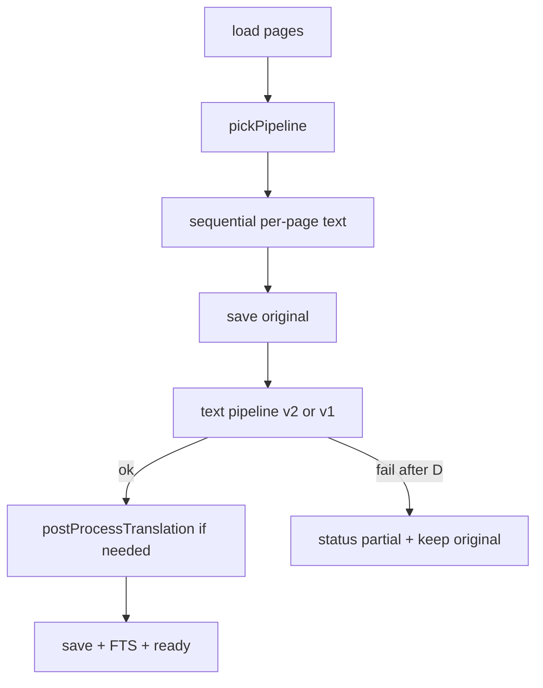

# Extraction and Ollama

**Who this is for:** Operators and developers tuning models, toggles, or hardware for document extraction.

**In one sentence:** Sonix turns page images into searchable text, an English translation, a short summary, and a document date—mostly via Ollama (vision and text), with optional Tesseract OCR when you ask for it.

**Where results surface in the UI:** Document detail uses a single **`AiPanel`** keyed by document status. Pending/failed/partial offer Extract/Retry with an **Extraction mode** combobox (**OCR (Tesseract)** or **LLM vision**). The initial selection is the letter’s last `engine_id` when present, otherwise the Settings auto-import default. Failed errors show a **short summary** only (raw Go/Ollama text stays in the server log). **Partial** means original page text was saved but translation/summary failed — original text remains visible and Retry re-runs the job. Ready shows summary (copy), document date, full text, and Re-process (same mode combobox). **View translation** / **View original text** open a scrollable reader overlay (near full-screen on phone; centred on desktop). Engine metadata is shown with the summary at all viewport widths. Panel copy stays brief—operator detail lives in this doc and Settings.

**Job lifecycle:** `Start` runs extraction under a cancellable context with an overall deadline (`EXTRACTION_JOB_TIMEOUT_MINUTES`, default 60). At most `EXTRACTION_MAX_CONCURRENT` jobs run at once (default 1); further Extract requests get HTTP 429 until a slot is free. Inbox auto-extract logs the busy error and leaves the letter **pending**. **Cancel extraction** / Reset aborts in-flight Ollama HTTP calls, not only the DB status flag. Per-call HTTP timeouts remain `OLLAMA_TIMEOUT_MINUTES`.

---

## What actually runs (defaults)

- **Default path:** Each page image goes to the **configured vision model** over **`/api/chat`** (image on the user message) with a short German Markdown-style prompt (see [`internal/ollama/prompts.go`](../internal/ollama/prompts.go)). The app does **not** use Tesseract unless you opt in.
- **Opt-in OCR:** `POST /api/documents/:id/extract` with JSON body `{"use_ocr": true}` runs **Tesseract** per page, then the **text pipeline** (translate / summary / document date), or legacy `ExtractMetadata` when `EXTRACTION_PIPELINE=v1`.
- **Legacy body field:** `{"ignore_ocr": true}` means “use the default (vision) path,” not OCR. It exists so older clients that sent this flag still get LLM vision.

The flow is implemented in [`internal/service/extraction.go`](../internal/service/extraction.go) (`RunExtraction`). HTTP trigger/status live in [`internal/server/extract.go`](../internal/server/extract.go).



---

## Pipeline strategies (log label `pipeline=`)

These align with `pickPipeline` and the `extraction:` log line (`pipeline=two_phase_ocr` | `two_phase_vision`).

| Strategy | When | Page engine |
|----------|------|-------------|
| `two_phase_ocr` | `use_ocr: true` | Tesseract (`OCR_ENGINE`, default tesseract; language `OCR_LANG` default `deu+eng`, `--dpi` from `OCR_DPI`, `--psm` from `OCR_PSM`) |
| `two_phase_vision` | `use_ocr: false` | Ollama vision `/api/chat` per page (`UnifiedVisionProfileName` → `engine_id` like `vision:unified-vision-v1`). Page images are **downscaled** for the LLM (long edge ≤ `OLLAMA_VISION_MAX_EDGE`, default **2048** in code) so 4K captures fit typical `num_ctx` (default request option **8192**, override with `OLLAMA_NUM_CTX`). Stored uploads stay full resolution. |

---

## Request rules that are not negotiable

Learned the hard way; changing any of these reintroduces a failure we have already had.

| Rule | Why |
|------|-----|
| **Vision posts `/api/chat`**, image on the user message | Models published with `RENDERER`/`PARSER` rather than a `TEMPLATE` (turbo declares `RENDERER qwen3-vl-instruct`) are templated by Ollama's renderer, which drives the chat path. The endpoints are not equivalent for such models ([ollama#14793](https://github.com/ollama/ollama/issues/14793)), and an instruct model with no chat wrapping **continues the document** instead of transcribing it — the page comes back repeated several times. Override with `OLLAMA_VISION_ENDPOINT=/api/generate` only to compare. |
| **`think: false` is top-level, never in `options`** | Ollama silently ignores unrecognized option keys, so `options:{think:false}` looks right and does nothing. On a thinking model the whole output budget then goes to reasoning tokens Ollama strips from `message.content`, which surfaces as `unexpected end of JSON input`. See [ollama#14716](https://github.com/ollama/ollama/issues/14716), [ollama#13353](https://github.com/ollama/ollama/issues/13353). |
| **No `system` message on the vision call** | The vision model's own Modelfile `SYSTEM` prompt carries the transcription rules. A request-level system message replaces it. |
| **Every call states `num_ctx` and `num_predict`** | Otherwise the model's Modelfile values apply. Turbo ships 4096 / 2048, so multi-page documents overflowed the window and dense pages truncated — invisibly, because `done_reason` was discarded. |
| **Greedy decode (`temperature 0`, `top_k 1`)** | Turbo ships `temperature 0.1 / top_k 20 / top_p 0.9`. Transcription and translation want the most likely token and a reproducible result; sampling makes the same page read differently twice and makes measurement meaningless. |
| **`repeat_penalty` around 1.1, not 1.5** | The penalty window is `repeat_last_n` (64 by default), so a high value cannot stop a page-length repeat, while it does push the model away from wording a letter legitimately repeats. Long-range repetition is detected separately. |

---

## Repetition guard

A vision model that is not templated as an instruct model transcribes the page over and over. The output is still valid Markdown, so nothing downstream notices: the translation is then made from a tripled document and the summary describes it.

[`repetition.go`](../internal/ollama/repetition.go) looks for a repeating cycle of substantial lines. When found, `ExtractPage` retries once and then **keeps the first cycle**, because that cycle is normally a correct read of the page — salvaging it beats failing the document. Short and legitimately repeated lines are ignored, so a letter that says "Möchten Sie" three times is not flagged.

Both the cycle and a `repeat_ratio` are reported on every page in the `ollama_call` line, so partial degeneration shows up even without a clean cycle.

---

## Rough LLM load (one document)

Use this with **[timing logs](#reading-timing-logs)** to compare real wall times. Counts are approximate; retries (up to 3 per page on failure) add more calls.

| Path | Vision calls | Text / chat calls |
|------|----------------|-------------------|
| OCR + metadata | 0 | per-page translate (skip blank/English) + summary + document date |
| Vision two-phase (N pages) | N on `/api/chat` | per-page translate + summary (+ map-reduce if long) + document date |

**Translate-only retry:** `TranslateFullTextEnglish` (`translate-only-v8`) uses a short German→English translator system prompt and sends the **letter body alone** as the user message (no “ORIGINAL DOCUMENT TEXT” label — that framing makes some OCR/text models echo the source). Long rule-lists are avoided for the same reason. It retries once with a short “previous attempt was still German” prompt when the reply still **looks predominantly German** (function-word cues — not a lone umlaut in a street name like `Weißstr.`). Fail-closed returns empty rather than storing German as English. Outer `postProcessTranslation` only re-runs on **exact echo** (not empty), so a failed strong-retry is not paid twice. If translation is empty, summary still runs from the **original** page text so operators get an English synopsis on `partial`.

**Document date:** `ExtractDocumentDate` asks for ISO from the letterhead `Datum:`/`Date:` line. Models sometimes return unpadded ISO (`2026-7-10`) or empty when body deadlines confuse them. Sonix zero-pads loose ISO, logs coerce/reject, and falls back to a deterministic `Datum:`/`Date:` parse on page 1 when the model field is empty. Library **category** is not extracted (manual tags only).

---

## Reading timing logs

Structured lines use the prefix **`extraction_timing`** (space-separated `key=value`). **Grep:** `grep extraction_timing` on your server logs.

| Event | Meaning |
|-------|---------|
| `pipeline_start` | Once per successful page load; includes `pages`, `use_ocr`, `pipeline` (strategy string), `cumulative_pipeline_ms=0`. |
| `page_step` | One line per **successful** sequential page (after retries). `page_index` matches the stored page index; `kind` is `ocr` or `vision_per_page`; `duration_ms` is that page’s wall time; `cumulative_pipeline_ms` is time since pipeline start. |
| `phase` | Non-page segments: e.g. `metadata`, `translate_only_retry`. |
| `pipeline_total` | End of run: `outcome=success`, `failed`, or `cancelled` (cooperative stop), `duration_ms` and `cumulative_pipeline_ms` (total wall time for the job). |

On **success**, the server also stores that wall time in **`extractions.extraction_wall_ms`** and exposes it as **`extraction_wall_ms`** on `GET /api/documents/:id` (optional; omitted on legacy rows or before the first completed run after upgrade).

### Per-call Ollama telemetry

Separate from `extraction_timing`, one line is emitted per Ollama call. **Grep:** `ollama_call`.

| Field | Meaning |
|-------|---------|
| `purpose` | `vision_page`, `metadata`, or `translate_only`. |
| `prompt_tokens` / `eval_tokens` | Input and output token counts from Ollama. |
| `prefill_ms` / `decode_ms` | Time reading the input versus writing the answer. **This is the field that tells you what to tune:** prefill-dominated means the image or context is too big; decode-dominated means the output is long or the model is slow. |
| `tok_s` | Output tokens per second — the number to compare across models and `num_thread` values. |
| `done_reason` | `stop` is complete; **`length` means the reply was cut off** by `num_predict`. |
| `content_len` / `thinking_len` | Visible reply size and reasoning size. `content_len=0` with a large `thinking_len` is a thinking model that needs `think:false` or an `-instruct` build. |
| `repeat_ratio`, `repeat_period`, `repeat_cycles` | Repetition guard output (vision only). |
| `unreadable` | Count of `[unleserlich]` markers the model emitted — a free, model-reported image-quality signal, and the cleanest way to compare phone captures against a flatbed scan. |

On a parse failure the first 4 KB of the model's raw reply is stored in **`extractions.raw_response`**, so a bad prompt can be diagnosed after the logs have rotated.

**Examples (illustrative):**

```
extraction_timing doc_id=42 event=pipeline_start pages=3 use_ocr=false pipeline=two_phase_vision cumulative_pipeline_ms=0
extraction_timing doc_id=42 event=page_step page_index=0 kind=vision_per_page duration_ms=8420 cumulative_pipeline_ms=8450
extraction_timing doc_id=42 event=phase phase=metadata duration_ms=12034 cumulative_pipeline_ms=28990
extraction_timing doc_id=42 event=pipeline_total outcome=success pages=3 duration_ms=29105 cumulative_pipeline_ms=29105
```

Implementation: [`internal/service/extraction_timing.go`](../internal/service/extraction_timing.go).

---

## Code map

| Piece | Location |
|-------|----------|
| HTTP trigger, `use_ocr` / `ignore_ocr` | `handleExtract` in [`internal/server/extract.go`](../internal/server/extract.go) |
| Pipeline choice, two-phase flow | `RunExtraction`, `pickPipeline` in [`internal/service/extraction.go`](../internal/service/extraction.go) |
| Per-page vision/OCR + retries | `extractOriginalTextSequential`, `extractPageWithRetry` (same service file) |
| Metadata + translation JSON | `ollama.Client.ExtractMetadata` in [`client.go`](../internal/ollama/client.go) |
| Prompts | [`prompts.go`](../internal/ollama/prompts.go) |
| Extracted-text Markdown viewer | [`web/src/components/MarkdownText.tsx`](../web/src/components/MarkdownText.tsx) — GFM tables via `normalizeMarkdownTables`, `break-words` for long IDs, `[unleserlich]` surfaced as inline code, outer fences stripped |

---

## OCR quality (German letters + phone capture)

**Why OCR used to trail the vision path:** Tesseract was hardcoded to `-l eng`, the container only shipped English training data, and canvas JPEGs were passed without `--dpi`, so Tesseract guessed DPI. German umlauts and compound words were systematically wrong. Capture was also capped at 1920×1080 (~17px capital height on A4), below the ~20–30px Tesseract wants.

**What changed (Phase 1):**

| Lever | Default | Notes |
|-------|---------|-------|
| Language packs | `deu`, `eng`, `osd` in the image | `OCR_LANG=deu+eng` |
| DPI hint | Estimated from page pixel size (A4); `OCR_DPI` forces a fixed value | Canvas/phone JPEGs have no DPI metadata |
| Segmentation | `--psm 1` | Auto + OSD orientation (rotated phone pages) |
| Capture | ideal **3840×2160** | Negotiates down if unsupported |
| Provenance | `engine_id` like `tesseract:deu+eng` | New rows only |

**Operator measurement (manual, one variable at a time):** use the same German letter, OCR path (`use_ocr: true`), and `grep extraction_timing` on the logs.

1. **Language** — compare `OCR_LANG=eng` vs `deu` vs `deu+eng` (keep resolution/psm fixed).
2. **Resolution** — capture at negotiated 1920-class vs 4K (keep winning language).
3. **PSM** — compare `OCR_PSM=3` vs `1` vs `6` (keep winning language + resolution).

Record wall time from `page_step` / `pipeline_total` and a short quality note (umlauts, numbers, addresses). Ship stays at `deu+eng` + `psm 1` unless latency or quality clearly prefers another value.

`ImageCapture.takePhoto()` is **not** enabled yet; revisit only if 4K video still undershoots ~30px capital height on your devices.

### Pre-upload colour modes

Before upload, the **review** screen (not the live camera) can apply:

| Mode | Behaviour |
|------|-----------|
| **Original** | No pixel transform (same blob as the capture; byte-identical) |
| **Clean** | Scanner-like grayscale: soft shadow flatten → gentle paper lift → mild sharpen (never hard B&W) |

Legacy **Gray** / **B&W** prefs migrate to **Clean**. Auto-deskew stays **off** (it caused quality regressions).

**Clean pipeline (detail):** convert to luminance; estimate page lighting with a large box blur (~14% of the short edge); blend ~40% of that “flattened” image with the original gray (capped at 50% so full Retinex cannot run); softly lift paper tones toward white while leaving dark ink alone; apply a light unsharp mask (~0.2). Encode as JPEG at quality 0.96.

Prefer **Original** when colour matters; **Clean** when you want an even, readable letter for vision/OCR.

---

## Related docs

- **[Configuration](configuration.md)** — Every switch and env var in one table.
- **[LLM request walkthrough](extraction-requests.md)** — Example request shapes.
- **[Performance](performance.md)** — Hardware class notes, Ollama tuning.
