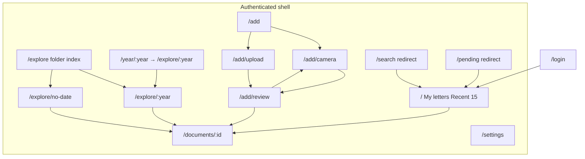

# Information architecture — Sonix (four-destination shell)

**Purpose:** Record the **current** IA after My letters became Recent 15 + search, and **Explore** became a fourth primary destination (year browse by letter date).

## Current route map (authoritative)

## Primary navigation (desktop + mobile)

- **Desktop:** Vertical **sidebar** — **My letters** (`/`), **Explore** (`/explore`), **Scan letters** (`/add`…), **Settings** (`/settings`), in that order. Logo in the sidebar header; page titles use in-route `PageHeader` (desktop Log out shortcut lives there).
- **Mobile:** **Bottom tabs** for the same four destinations in the **same order**, with **Scan** (short label) as the circular FAB-style control (no hamburger / left drawer for main IA). Thin **top strip** shows Sonix brand and the current section title on the right (e.g. My letters).
- **Installable shell:** `web/public/manifest.webmanifest` + icons; Android Chrome can install as a standalone app. No service worker (self-signed HTTPS on `:9443`).
- **Server unreachable:** network / timeout on the session probe shows a dedicated **Cannot reach Sonix** screen rather than login-or-empty.

## My letters (`/`)

Default content is the **15 most recent** letters (no Load more on the default view):

1. Sticky **search** — text + icon Search; full-width **Select**; date/filters behind foldable disclosures.
2. **Recent 15** cards by default; **filtered or searched** views keep paginated list behaviour (Load more, `total`).
3. Pending/failed work: **nav queue badge** on My letters; filter via **More options → Status** (or legacy `/pending`).

**Library chrome:** sticky search + Select; **Date filters** and **More options** (layout/sort + Status / Tags / Year multi-select comboboxes; empty = no filter). No dedicated Queue control in the card. On phone, opening More options locks background list scroll until closed. **Select** enters ephemeral multi-delete mode.

Cards: shared **3:4** portrait thumbnail (`object-cover object-top`), title, status, relative/absolute date, page count. Short tap opens the document; **press-and-hold** the thumb (or **Preview first page**) opens a full-page preview `Modal` (Close / Escape / backdrop). Single-letter **Delete** remains on document detail; **Select** on My letters enables multi-delete (no ⋯ menu on cards).

**URL filters** (shareable): `q`, `date_from` / `date_to` (document date), `status` (comma OR), `tag` (comma OR), `year` (upload year comma OR), `layout`, `sort`. Older letters: use **search** or **Explore**. Retired: `?category=` is stripped (auto-category sunset).

**Legacy mapping:** `?section=pending` → Queue status (`pending,failed,partial`); `?section=search` → focus search; `?section=years` → strip section. Routes **`/search`** and **`/pending`** redirect into the same flat params (`focus=search` / queue `status`).

## Explore (`/explore`, `/explore/:year`, `/explore/no-date`)

- **Folder index** `/explore` — year tiles by **letter date** (`GET /api/documents/document-date-years`) plus **No date** when `undated_count > 0`.
- **Year contents** `/explore/:year` — letters for that letter-date year, sorted by letter date (`document_date_from` / `document_date_to`, `sort=date_desc`).
- **No date** `/explore/no-date` — `undated=1`, ordered by import date.
- **Legacy** `/year/:year` **redirects** to `/explore/:year` (basis changed from import year to letter year).

## Scan / capture (`/add`, `/add/camera`, `/add/review`, `/add/upload`)

- **Hub** `/add` — camera or file upload.
- **Camera** `/add/camera` — same full-screen black editor shell as crop/colour. Capture only; torch and tap-to-focus when supported. **Cancel** returns to review without losing the draft when opened from retake/add-more; **Done** returns to review once at least one page exists. Fresh scans from the hub use Cancel to abandon.
- **Review** `/add/review` — post-capture edit workspace: reorder, rotate, **crop**, **colour** (Original / Clean on the still; apply to one page or all), delete, retake, add more, then **Save**. Crop and colour use the same black full-screen shell (Cancel · title · Done). Mobile bottom bar uses icon actions + Save. Header **Cancel** confirms before discarding all pages (“Discard this scan?” → Keep editing / Discard).
- **Upload** `/add/upload` — images go into the same review draft; PDFs still upload directly from this screen.

## Document detail (`/documents/:id`)

- **Layout:** `PageViewer` (thumbnails + page image) and a metadata/actions column. On narrow widths the **viewer is first**; at `md+` they sit **side by side**.
- **Viewer:** vertical scrollable thumbnail rail beside the preview (same at all widths); page indicator (“N of M”); icon-only **Rotate clockwise**, **Full screen**, and **Share or download** in the Pages header (tap the image also opens full screen for pinch-zoom). Rotate rewrites the stored page image and refreshes the thumb. Web Share when available, else file download of the current page.
- **Title:** tap the name to edit. Leaving the field (or Enter) with a change opens **Save name change?** (Save / Cancel discards). Escape discards. **Phone header:** icon Back · name · status pill · icon Delete. **Desktop:** text Back, status pill beside the title, Rename + Delete + Log out.
- **`AiPanel`:** one status-driven panel for extraction — pending (Extract + OCR + Extract now), processing (progress + Cancel), failed (error + OCR + Retry), **partial** (original saved + OCR + Retry), ready (summary with copy, document date, incomplete banner, full text, Re-process). Primary actions stay **inside** their section cards at all widths (no sticky bottom bar). **All widths:** “View translation” / “View original text” open a scrollable reader (near full-screen on phone; centred popup on desktop). Engine metadata is visible at all widths. UI copy stays short.
- **Tags** remain a separate editor below the AI panel (same column spacing as other cards).

## Settings (`/settings`)

- Ollama URL + model + save / test connection.
- **Auto-import scans:** Printer IP, enable scan-folder watch, extract after import (see [auto-import-scans.md](../auto-import-scans.md)).
- **Export data** (`GET /api/export`) and **Log out** live here at all widths; desktop also keeps the `PageHeader` Log out shortcut.

## What already matches a good “document hub” pattern

- **Scan** is one tap away (circular FAB-style treatment on mobile).
- **Recent + search** keeps the home list short; **Explore** owns year browse by letter date.
- Queue badge + Status multi-select still surfaces pending and failed work from My letters.

## Optional IA follow-ups (priority order)

1. ~~Badge on **My letters** tab from queue count.~~ — done (`useQueueCount` + Layout badge).
2. ~~**Remove `Home.tsx`**~~ — removed; it was not routed from `App.tsx`.
3. ~~**`newUX` cleanup**~~ — `FeatureFlagsProvider` and `web/src/lib/featureFlags.ts` removed from the tree.
4. ~~**Unified document list**~~ — done as the flat My letters library (Phase 5b); later replaced by Recent 15 + Explore.
5. ~~**Explore fourth destination**~~ — done (`/explore`, letter-date years + No date; `/year/:year` redirects).

## Related

- [architecture.md](architecture.md) — stack entry point
